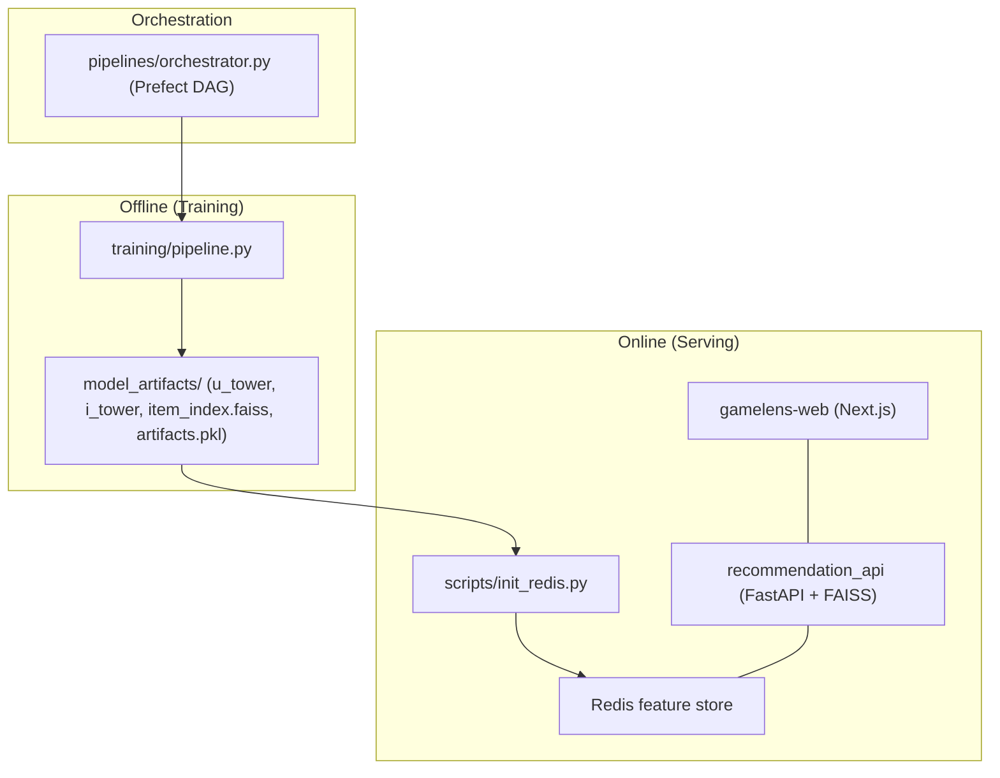

# GameLens

**A production-style, two-tower retrieval recommender for Steam games - trained, served, and orchestrated end to end.**

---

## Description

GameLens takes the full lifecycle of a real recommendation system and puts it in one repo. It covers an offline training pipeline that produces versioned model artifacts, a low-latency FastAPI serving layer with cache-first lookups and a documented cold-start path, an online feature-refresh loop, a Prefect retraining DAG with deployment gates and A/B routing, and a Next.js frontend.

It is a personal project trained on the public UCSD Steam dataset. The demo path runs on a 10% sample so you can boot the whole thing in minutes without a GPU.

Two neural towers -- a **User Tower** and an **Item Tower** -- are trained jointly with in-batch InfoNCE so that a user embedding and an item embedding can be compared with a simple dot product. Because both towers end in L2 normalization, that dot product *is* cosine similarity.

- **Item embeddings** are precomputed once per training run and stored in a flat FAISS index (`item_index.faiss`, `IndexFlatIP`).
- **User embeddings** are computed on demand from a user's feature vector and cached in Redis.
- Serving = "embed the user -> FAISS nearest-neighbor search over items -> re-rank -> return."



---

## Features

- **Personalized recommendations** -- given a `user_id`, return games ranked for that user.
- **Item-to-item similarity** -- given a game, return the most similar games (no user profile needed).
- **Learns online** -- user interactions (clicks, purchases, playtime) refresh that user's embedding within seconds.
- **Retrains safely** -- a scheduled DAG retrains, evaluates against quality gates, and only promotes a model that beats a popularity baseline.

Key design decisions:

- **One feature function, two call sites, one test.** `core_ml/features.py:build_user_vector()` is called from both training (Stage 3, batch) and the online `nearline.py` updater (per event). `tests/test_feature_parity.py` pins it against a frozen reference, so a refactor that silently changes the math fails a test instead of degrading live recommendations. This is the actual fix for training-serving skew.
- **Redis is gated by a readiness sentinel.** The API refuses to boot unless a `system:ready` key exists (written at the end of `init_redis`), rather than serving empty recommendations. The same key backs Docker Compose's `depends_on: service_healthy` for the frontend.
- **Retrieval fails soft in three tiers.** Cached embedding -> recompute from stored features via the User Tower -> cold-start popularity fallback. Cold start is a normal UX event, not a 500.
- **The retraining DAG has gates, not just steps.** Deployment only happens if the new model beats a popularity baseline and clears absolute Recall@20 / NDCG@20 thresholds from `config.yaml`. Thresholds live in config, not code.

---

## Tech Stack

TensorFlow / Keras + FAISS (model) · FastAPI + Pydantic v2 + Redis (serving) · Prefect (orchestration) · Next.js + Tailwind (frontend) · Docker Compose (infra).

---

## Installation

The fast path uses pre-built demo artifacts and skips training entirely.

```bash
git clone https://github.com/BUZEL-112/GameLens.git && cd GameLens
pip install -r requirements.txt

make setup-api        # download demo artifacts + start Redis + populate it (~5 min, no GPU)
make test             # parity + smoke tests against the live API
make setup-frontend   # boots the full stack with the Next.js UI at :3000
```

Once up:

- **API:** http://localhost:8000
- **Swagger docs:** http://localhost:8000/docs
- **Health:** http://localhost:8000/health
- **Web UI:** http://localhost:3000

To run the **full ML pipeline** instead (downloads ~1 GB raw data, trains on CPU in ~30-45 min):

```bash
make setup-ml
```

To bring up the entire production-like stack (redis + api + web) in Docker:

```bash
make up
```

**Project structure:**

```
configs/config.yaml      single source of truth: hyperparameters, paths, thresholds
core_ml/features.py      build_user_vector - shared by training and serving (no I/O, no TF)
training/                pipeline stages 1-6, two-tower model (train.py), evaluate.py
recommendation_api/      FastAPI app: routers, retrieval/reranking/nearline services, Redis store
pipelines/               Prefect DAG (orchestrator.py) + A/B routing (ab_testing.py)
scripts/init_redis.py    one-time bulk load of artifacts.pkl into Redis
gamelens-web/            Next.js frontend, proxies /rec/* to the API
tests/                   feature-parity test pinning core_ml.features to a frozen reference
e2e_test.py              artifact integrity checks + live-API smoke test via TestClient
```

---

## Configuration

Everything is centralized in `configs/config.yaml`. Notable knobs:

- **Model:** `embedding_dim: 128`, `temperature: 0.1`, `batch_size: 512`, `epochs: 100`.
- **Sampling:** `sample_fraction: 0.1` (demo scale), `max_interactions_per_user: 20`.
- **Deployment gates:** `min_recall_20: 0.15`, `min_ndcg_20: 0.05`.
- **Serving:** `n_candidates: 100`, `max_genres_per_response: 3`.

Serving-related env vars (see `docker-compose.yml`): `REDIS_HOST`, `REDIS_PORT`, `REDIS_DB`, `ARTIFACTS_PATH`, `API_KEY`.

---

## Usage

All `/v1/*` routes require an `X-API-Key` header matching the server's configured key (default `dev-insecure-key`). `/health`, `/docs`, `/openapi.json`, and `/redoc` are exempt.

### `GET /v1/recommendations`

Personalized or item-to-item recommendations.

| Param | Type | Default | Notes |
| :-- | :-- | :-- | :-- |
| `user_id` | string | (required) | The user to recommend for. |
| `count` | int | 20 | 1-100. |
| `context` | enum | `homepage` | e.g. `cart` triggers a contextual boost in reranking. |
| `item_name` | string | none | If set, switches to **item-to-item** mode. |

Behavior:

- `item_name` present -> item-to-item similarity (no user profile needed).
- Known user -> Two-Tower retrieval + reranking (`source: "model"`).
- Unknown user -> popularity fallback (`source: "popularity_fallback"`), not an error.

Response (`RecommendationResponse`): a list of `{item_name, score, reason, boosted}` plus `source`, `model_version`, and `latency_ms`.

### `POST /v1/events`

Record a user interaction (`click`, `purchase`, `playtime`, `add_to_cart`). Returns `202` immediately; the nearline updater refreshes the user's embedding asynchronously.

### `GET /v1/items/{item_name}/similar`

Top-N most similar games to a given game.

### `GET /v1/items/search?q=...`

Discover exact item names in the vocabulary (handy since recommendations key on human-readable titles).

---

## Testing

```bash
make test       # end-to-end: artifact shape/L2-norm checks + a live-API smoke test via TestClient
make test-unit  # API + training unit tests, no Docker required
```

Known limitations:

- Demo artifacts are a **10% sample** -- recommendation quality at that scale is a structural-validity check, not a relevance benchmark.
- The in-memory rate limiter is single-process; a multi-worker deployment needs the Redis `INCR`+`EXPIRE` swap noted in `core/security.py`.
- A/B experiment state lives in flat JSON files -- safe on one machine, not under concurrent writers.
- No frontend auth; user identity is a client-generated UUID in `localStorage`.

---

## License

This project is for personal and educational use. See the repository for details.